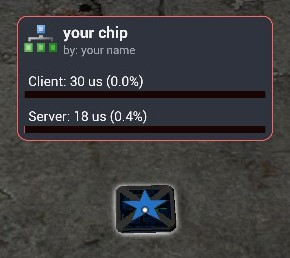

## 📚 custom_overlay.lua

### Description  
This library allows you to display a custom overlay on your Starfall chip.  
It shows the CPU usage (client and server) and lets you set a custom icon and main color.

---

### Preview  


---

### Usage

```lua
--@name your chip
--@author your name
--@include lib/custom_chip_overlay.lua

local overlay = require("lib/custom_chip_overlay.lua") --must be included as shared (server and client)


if CLIENT then
    --note: it is recommended to use an UnlitGeneric material
    local icon = material.createFromImage("icon16/chart_organisation.png", "")

    --set a custom icon (default is: radon/starfall2.png)
    overlay.set_icon(icon)

    --set a custom main color (default is: Color(68, 202, 229))
    overlay.set_global_color(Color(255, 100, 100)) --example: light red
end
```